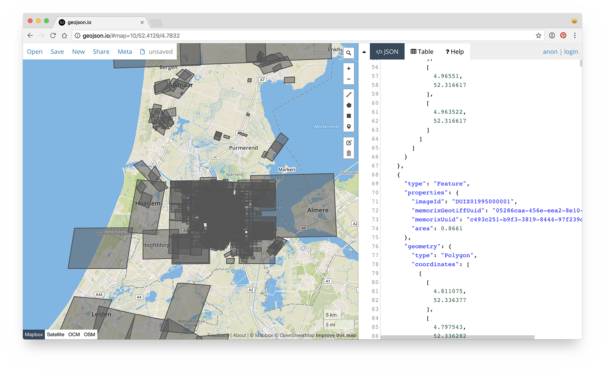

# HackaLOD 2018

## Results

- [Map area data](https://github.com/bertspaan/hackalod/blob/master/data/all-masks.geojson)

[](https://github.com/bertspaan/hackalod/blob/master/data/all-masks.geojson)

- [Map Me](http://lab.adamlink.nl/mapme/index.html)

Map area data is available via the [Adamlink SPARQL endpoint](https://data.adamlink.nl/menno/alles/services/alles#). Example query:

```sparql
PREFIX dc: <http://purl.org/dc/elements/1.1/>
PREFIX dct: <http://purl.org/dc/terms/>
PREFIX geo: <http://www.opengis.net/ont/geosparql#>
PREFIX sem: <http://semanticweb.cs.vu.nl/2009/11/sem/>
PREFIX foaf: <http://xmlns.com/foaf/0.1/>
PREFIX wdt: <http://www.wikidata.org/prop/direct/>
select ?kaart ?img ?x ?y ?title {
  ?kaart dct:spatial ?spatial .
  ?kaart foaf:depiction ?img .
  ?kaart dc:title ?title .
  ?spatial dc:type "outline"^^xsd:string .
  ?spatial geo:hasGeometry/geo:asWKT ?wktmap .
  ?spatial wdt:P2046 ?km2 .
  bind (bif:st_geomfromtext("POINT(4.895168 52.370216)") as ?x)
  bind (bif:st_geomfromtext(?wktmap) as ?y)
  FILTER (bif:st_intersects(?x, ?y))
}
ORDER BY ASC(?km2)
limit 5
```

- [Amsterdam op de Kaart](http://bertspaan.nl/amsterdam-op-de-kaart)

[](http://bertspaan.nl/amsterdam-op-de-kaart)

## Scripts

1. [`scrape-beeldbank.js`](scripts/scrape-beeldbank.js): scrape [all georectified maps from the Beeldbank](http://beeldbank.amsterdam.nl/beeldbank/indeling/grid?f_string_geoserver_store%5B0%5D=%2A)
2. [`create-links.js`](scripts/create-links.js): save permalinks and UUIDs, merge with CSV data
3. [`download-tiffs.sh`](scripts/download-tiffs.sh): download all GeoTIFFs from WMS server
4. [`extract-masks.sh`](scripts/extract-masks.sh): use GDAL to turn GeoTIFFs into GeoJSON
5. [`to-spacetime.js`](scripts/to-spacetime.js): convert to [NYC Space/Time Directory](http://spacetime.nypl.org) data format
6. [`feature-collection.js`](scripts/feature-collection.js): create GeoJSON file with all masks
7. [`group-maps.js`](scripts/group-maps.js): group all maps in groups of 25 years

## Example links

  - Thumbnails:
    - http://images.memorix.nl/ams/thumb/140x140/de61435f-d219-0f32-8930-3ec48422fcea.jpg
    - http://images.memorix.nl/ams/thumb/1000x1000/1fc4dfdc-e92c-6f65-2f3a-e960f9e52222.jpg
  - GeoTIFF:
    - http://geoserver.memorix.nl/geoserver/ams/wcs?service=WCS&version=2.0.1&request=GetCoverage&format=image/tiff&CoverageId=ams:abef258-08a5-4057-b154-acc4c112c678
  - JPG:
    - http://beeldbank.amsterdam.nl/component/ams_memorixbeeld_download/?view=download&format=download&id=DUIZ00345000001
  - WMS:
    - http://geoserver.memorix.nl/geoserver/ams/wms?SERVICE=WMS&REQUEST=GetMap&VERSION=1.1.1&LAYERS=ams%3Adabef258-08a5-4057-b154-acc4c112c678&STYLES=&FORMAT=image%2Fpng&TRANSPARENT=true&HEIGHT=256&WIDTH=256&ZINDEX=1&SRS=EPSG%3A4326&BBOX=4.85595703125,52.36218321674427,4.8779296875,52.3755991766591
